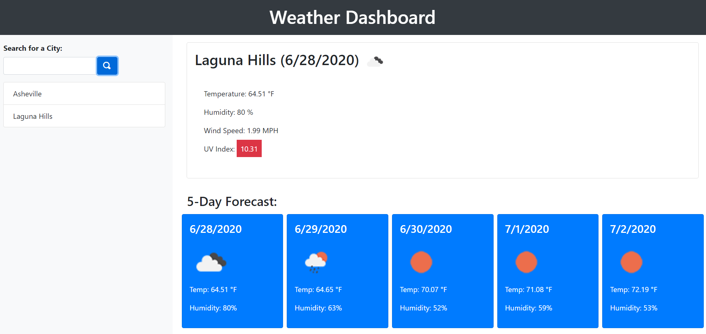

# Weather Dashboard
This application builds a screen that allows the user to insert a city into a search box 
and displays the weather statistics for that particular city.  It utilizes OpenWeather API
in order to retrieve current weather data.  Once entered, the city is saved in local
storage so it can be easily viewed again.

## Software
HTML5  
CSS3  
JavaScript  
OpenWeather API  
Application presents a basic HTML5 design, with CSS3 to add styling to the framework.
It uses JavaScript to build the weather cards with data pulled from OpenWeather API.

## Pending Updates
1) Next steps, add media queries for better layouts on smaller devices.  
2) Add fancy CSS to make the page more visually appealing.  
3) Add a remove button on the city list.

## Links
GitHub Repository: https://github.com/nmcanall/weather-dashboard  
Deployed Site: https://nmcanall.github.io/weather-dashboard/

## Preview
